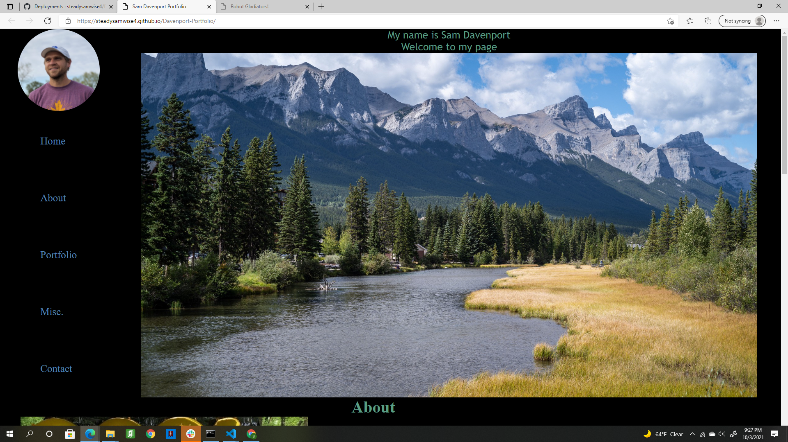

# Davenport-Portfolio
Introduction to developer-in-training, Sam Davenport.

## Motivation, What I Did, and What I Learned
This project was challenging in that I was mostly on my own from the start in building the html and css. I learned that I still have much to learn. I gained in my skill and comfort level. Towards the end of the project, I was getting better at building the site using the flexbox properties. I attempted to use mobile first, but it ended up being more suited to large screens. It isn't terrible for mobile, though. As I said,  I still have much to learn. In addition to learning, this project is also valuable in beginning to build an online presence as a developer. I don't have much to show off at this point, but it seems good to begin the process and have a starting point from which I can improve.

## Links
Below you will find a link to the deployed page and a screenshot of how it appears in the browser.

https://steadysamwise4.github.io/Davenport-Portfolio/